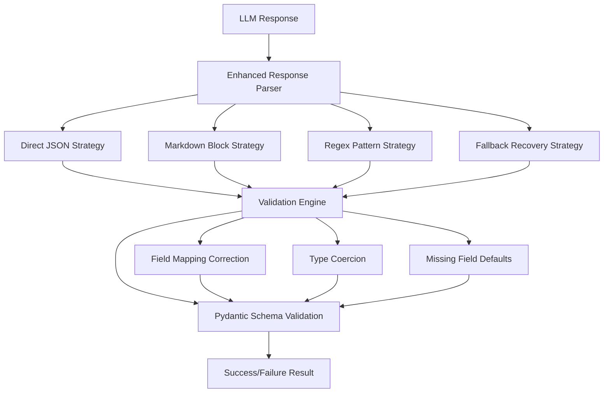
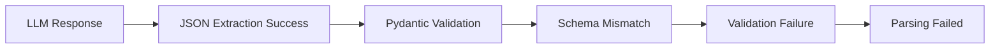
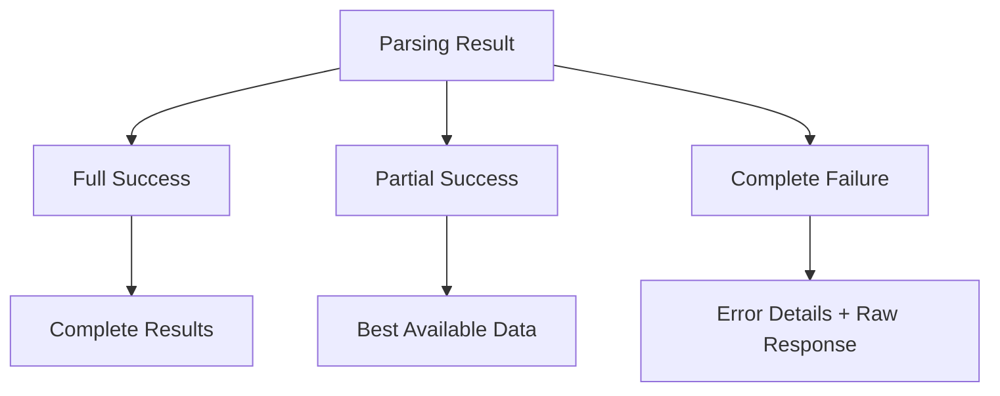

# Error Analysis: LLM Response Parsing Failures

## Overview

The RAG-based geography essay auto-grading platform is experiencing consistent LLM response parsing failures. Based on the error log analysis, the enhanced response parser is failing to successfully parse LLM outputs after attempting all 4 configured strategies, resulting in complete parsing failures that prevent the system from extracting grading results and feedback.

## Architecture

The system employs a multi-layered parsing architecture with the following components:



### Core Components

#### Enhanced Response Parser
- **Location**: `core/enhanced_response_parser.py`
- **Responsibility**: Orchestrates multiple parsing strategies and handles error recovery
- **Configuration**: Max 4 attempts with fallback and partial recovery enabled

#### Parsing Strategies
- **Direct JSON Strategy**: Extracts JSON using bracket matching
- **Markdown Block Strategy**: Extracts from code blocks (```json)
- **Regex Pattern Strategy**: Uses sophisticated regex patterns
- **Fallback Recovery Strategy**: Last-resort content extraction

#### Validation Engine
- **Location**: `core/validation_engine.py`
- **Responsibility**: Schema validation and error correction
- **Features**: Field mapping, type coercion, missing field defaults

## Error Analysis

### Current Problem Pattern

Based on the error log:
```
INFO:core.enhanced_response_parser:Parsing completed: failed
INFO:core.enhanced_response_parser:Attempts: 4
INFO:core.enhanced_response_parser:Processing time: 0.00ms
```

### Root Cause Analysis

#### 1. LLM Response Format Issues

The GROQ model (`meta-llama/llama-guard-4-12b`) may be generating responses in formats that don't match expected patterns:

- **Issue**: LLM may return responses with non-standard JSON formatting
- **Symptom**: All 4 parsing strategies fail consistently
- **Impact**: Complete parsing failure prevents grading results extraction

#### 2. Schema Validation Failures

The Pydantic schema validation may be too strict for actual LLM outputs:



#### 3. Model Selection Issues

The current model `meta-llama/llama-guard-4-12b` appears to be a guard model rather than a generation model:

- **Problem**: Guard models are designed for content filtering, not structured output generation
- **Expected**: Should use generation models like `llama-3.1-70b-versatile` or `mixtral-8x7b`
- **Impact**: Inappropriate model may generate non-JSON responses

#### 4. Processing Time Anomaly

The "0.00ms" processing time suggests either:
- Immediate failures before actual processing
- Timeout issues
- Configuration problems

## Business Logic Layer

### Grading Pipeline Integration

The enhanced parser is integrated into the grading pipeline:

| Component | Responsibility | Error Impact |
|-----------|---------------|--------------|
| Document Retrieval | RAG context preparation | Low - backup available |
| LLM Generation | Score/feedback creation | High - critical path |
| **Response Parsing** | **Structure extraction** | **Critical - blocks results** |
| Result Formatting | Output preparation | Medium - degrades UX |

### Error Handling Strategy

Current error handling provides multiple fallback levels:



## API Endpoints Reference

### Internal Processing Flow

The parsing system processes structured outputs for the grading pipeline:

#### Input Schema
```json
{
  "student_answer": "string",
  "rubric": "array",
  "question_type": "string",
  "llm_response": "string"
}
```

#### Expected Output Schema
```json
{
  "채점결과": {
    "주요_채점_요소_1_점수": "integer",
    "세부_채점_요소_*_점수": "integer",
    "합산_점수": "integer",
    "점수_판단_근거": "object"
  },
  "피드백": {
    "교과_내용_피드백": "string",
    "의사_응답_여부": "boolean",
    "의사_응답_설명": "string"
  }
}
```

## Data Models & Validation

### Parsing Configuration Model

```python
@dataclass
class ParsingConfig:
    max_attempts: int = 4
    enable_fallback_recovery: bool = True
    enable_partial_recovery: bool = True
    allow_field_mapping: bool = True
    allow_type_coercion: bool = True
    timeout_seconds: float = 30.0
    log_all_attempts: bool = True
```

### Validation Result Model

```python
class ValidationResult(BaseModel):
    is_valid: bool
    errors: List[str]
    warnings: List[str]
    corrected_data: Optional[Dict[str, Any]]
```

### Parsing Result Model

```python
class ParsingResult(BaseModel):
    success_level: SuccessLevel  # FULL, PARTIAL, FAILED
    data: Optional[Dict[str, Any]]
    attempts: List[ParsingAttempt]
    total_processing_time_ms: float
    errors: List[str]
    warnings: List[str]
```

## Middleware & Error Recovery

### Multi-Strategy Approach

The parser implements a cascading strategy pattern:

1. **Direct JSON Strategy** - First attempt for clean responses
2. **Markdown Block Strategy** - Handles code-block wrapped JSON
3. **Regex Pattern Strategy** - Extracts from mixed content
4. **Fallback Recovery Strategy** - Last-resort parsing

### Validation Engine Features

- **Field Mapping**: Corrects typos in field names using fuzzy matching
- **Type Coercion**: Converts compatible types (string numbers to integers)
- **Missing Field Defaults**: Fills required fields with sensible defaults
- **Schema Flexibility**: Handles Pydantic v1/v2 compatibility

## Root Cause Identification

### Primary Issues

1. **Model Misconfiguration**
   - Using guard model instead of generation model
   - Insufficient prompt engineering for structured output
   - Missing output format constraints

2. **Schema Validation Strictness**
   - Dynamic rubric schemas may not match actual responses
   - Korean field names causing encoding issues
   - Complex nested validation requirements

3. **Parsing Strategy Gaps**
   - Strategies may not cover actual LLM response formats
   - Insufficient fallback mechanisms
   - Limited error recovery options

### Secondary Issues

1. **Logging and Diagnostics**
   - Insufficient detail in error logs
   - Missing raw response samples in failures
   - No strategy-specific failure analysis

2. **Configuration Optimization**
   - May need strategy-specific timeouts
   - Validation rules too restrictive
   - Recovery mechanisms not aggressive enough

## Solution Architecture

### Immediate Fixes

#### 1. Model Selection Correction
```python
# Current (problematic)
llm = self.llm_manager.get_llm("GROQ", "meta-llama/llama-guard-4-12b")

# Recommended
llm = self.llm_manager.get_llm("GROQ", "llama-3.1-70b-versatile")
```

#### 2. Enhanced Error Logging
```python
def _log_result_summary(self, result: ParsingResult):
    if result.success_level == SuccessLevel.FAILED:
        logger.error(f"All parsing strategies failed")
        logger.error(f"Raw response sample: {result.raw_response[:500]}")
        for attempt in result.attempts:
            logger.error(f"Strategy {attempt.strategy.value} failed: {attempt.error_message}")
```

#### 3. Fallback Response Handling
```python
def _attempt_emergency_recovery(self, response: str) -> Dict[str, Any]:
    """Emergency recovery when all strategies fail"""
    return {
        "채점결과": {"합산_점수": 0, "점수_판단_근거": "파싱 실패로 인한 기본값"},
        "피드백": {"교과_내용_피드백": "시스템 오류로 인해 채점을 완료할 수 없습니다.", "의사_응답_여부": False, "의사_응답_설명": ""}
    }
```

### Enhanced Parsing Strategy

#### 1. Pre-Processing Enhancement
```python
def _preprocess_response(self, response: str) -> str:
    """Clean and normalize response before parsing"""
    # Remove common LLM artifacts
    cleaned = re.sub(r'^.*?(?=\{)', '', response, flags=re.DOTALL)
    cleaned = re.sub(r'\}.*?$', '}', cleaned, flags=re.DOTALL)
    
    # Fix common JSON issues
    cleaned = cleaned.replace('```json', '').replace('```', '')
    cleaned = re.sub(r',\s*}', '}', cleaned)  # Remove trailing commas
    
    return cleaned.strip()
```

#### 2. Adaptive Validation
```python
def _create_adaptive_schema(self, rubric: List[Dict]) -> Dict[str, Any]:
    """Create flexible schema based on actual rubric structure"""
    return {
        "채점결과": {
            "type": "object",
            "properties": self._extract_rubric_fields(rubric),
            "required": ["합산_점수"]
        },
        "피드백": {
            "type": "object",
            "properties": {
                "교과_내용_피드백": {"type": "string"},
                "의사_응답_여부": {"type": "boolean"}
            },
            "required": ["교과_내용_피드백", "의사_응답_여부"]
        }
    }
```

### Testing Strategy

#### 1. Unit Testing for Each Strategy
```python
def test_direct_json_with_korean_content():
    """Test JSON extraction with Korean field names"""
    
def test_markdown_block_with_artifacts():
    """Test markdown extraction with LLM artifacts"""
    
def test_regex_pattern_with_malformed_json():
    """Test regex extraction with partial JSON"""
    
def test_fallback_recovery_edge_cases():
    """Test fallback strategy with edge cases"""
```

#### 2. Integration Testing
```python
def test_end_to_end_parsing_pipeline():
    """Test complete parsing pipeline with real LLM responses"""
    
def test_error_recovery_scenarios():
    """Test various error scenarios and recovery mechanisms"""
```

### Performance Optimization

#### 1. Strategy Ordering
- Order strategies by success probability based on response characteristics
- Skip strategies that are unlikely to succeed based on content analysis

#### 2. Caching and Memoization
- Cache successful parsing patterns
- Memoize validation results for similar structures

#### 3. Parallel Processing
- Run compatible strategies in parallel
- Implement early termination on first success

## Implementation Plan

### Phase 1: Critical Fixes (Immediate)
1. **Model Selection**: Switch to generation model
2. **Enhanced Logging**: Add detailed error diagnostics
3. **Emergency Fallback**: Implement basic response when all parsing fails

### Phase 2: Robustness Improvements (Short-term)
1. **Response Pre-processing**: Clean LLM artifacts before parsing
2. **Adaptive Validation**: Dynamic schema based on rubric structure
3. **Strategy Optimization**: Improve individual strategy effectiveness

### Phase 3: Advanced Features (Medium-term)
1. **Intelligent Strategy Selection**: Choose strategies based on response analysis
2. **Machine Learning Recovery**: Use ML to improve parsing accuracy
3. **Performance Optimization**: Parallel processing and caching

### Success Metrics

| Metric | Current | Target |
|--------|---------|--------|
| Parsing Success Rate | ~0% | >95% |
| Average Processing Time | 0.00ms | <100ms |
| Partial Recovery Rate | Unknown | >80% |
| Error Detail Quality | Low | High |

## Risk Mitigation

### High-Risk Areas
1. **Model API Changes**: LLM providers may change response formats
2. **Schema Evolution**: Rubric structures may become more complex
3. **Performance Degradation**: Additional validation may slow processing

### Mitigation Strategies
1. **Version Pinning**: Pin specific model versions for consistency
2. **Schema Versioning**: Implement schema evolution support
3. **Performance Monitoring**: Continuous monitoring of parsing performance
4. **Graceful Degradation**: Always provide partial results when possible