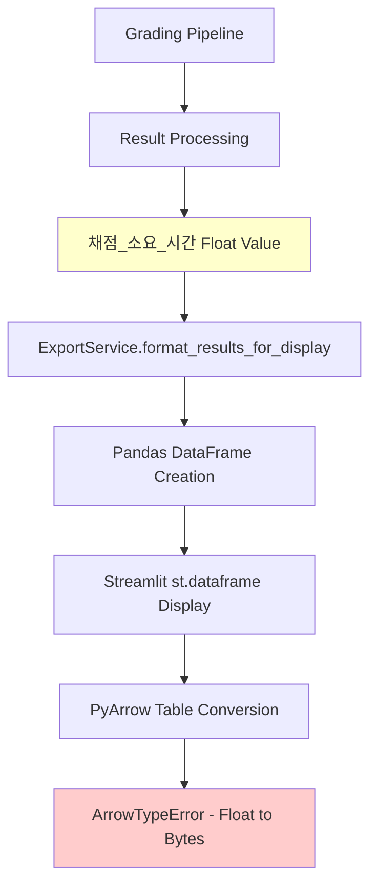
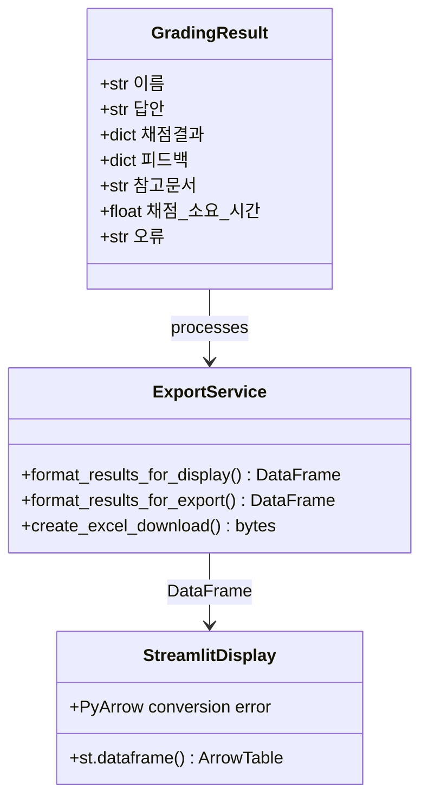
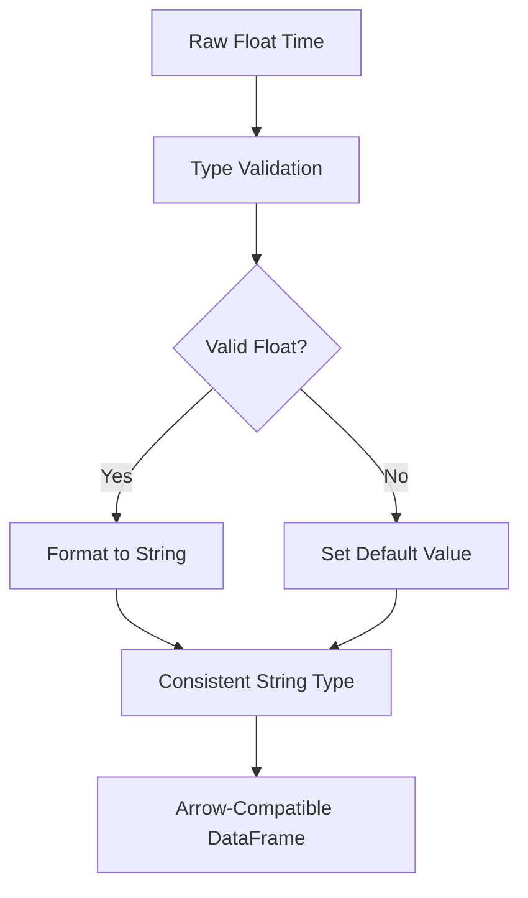
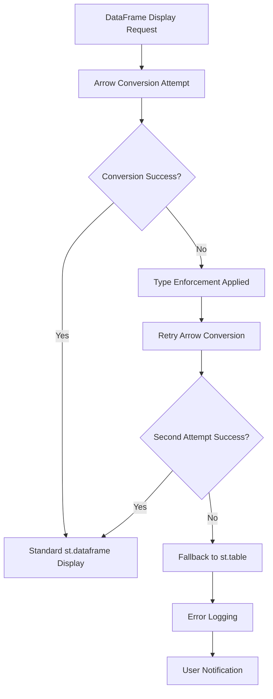

# Streamlit Cloud Arrow Table Serialization Error Fix

## Overview

This design document addresses a critical data type conversion error that occurs when deploying the geography essay auto-grading platform to Streamlit Cloud. The error manifests as an `ArrowTypeError` during DataFrame serialization, specifically with the `채점_소요_시간` (grading time) column containing float values that PyArrow cannot convert to the expected bytes format.

**Problem Summary:**
- Platform fails to display grading results in Streamlit Cloud deployment
- PyArrow serialization error: "Expected bytes, got a 'float' object"
- Error occurs specifically with the `채점_소요_시간` column containing timing data
- Issue prevents users from viewing grading results and downloading Excel reports

## Repository Type

**Backend Service** - Python-based grading pipeline with Streamlit web interface
- Core functionality: RAG-based geography essay grading
- Technology: Python, Streamlit, Pandas, PyArrow
- Data processing: Structured result formatting and export

## Architecture

### Current Data Flow and Error Point



### Data Type Issue Analysis

The error occurs in the data serialization pipeline:

1. **Data Generation**: `채점_소요_시간` is calculated as `float` (seconds)
2. **DataFrame Creation**: Mixed data types in same DataFrame
3. **Streamlit Display**: Automatic conversion to Arrow table format
4. **PyArrow Conversion**: Type mismatch between expected bytes and actual float



## Data Models & Type Safety

### Current Data Model Issues

| Column | Current Type | Expected Type | PyArrow Expectation |
|--------|-------------|---------------|-------------------|
| 이름 | str | str | string |
| 답안 | str | str | string |
| 채점결과 | str (converted) | str | string |
| 피드백 | str (converted) | str | string |
| 참고문서 | str | str | string |
| **채점_소요_시간** | **float** | **str/formatted** | **string** |
| 오류 | str/None | str | string |

### Proposed Data Model Enhancement



## Business Logic Layer

### Enhanced Type Conversion Strategy

#### 1. Grading Time Formatting Service

```python
class GradingTimeFormatter:
    @staticmethod
    def format_grading_time(time_value: Union[float, None, str]) -> str:
        """Convert grading time to Arrow-compatible string format"""
        if time_value is None:
            return "N/A"
        if isinstance(time_value, str):
            return time_value
        if isinstance(time_value, (int, float)):
            return f"{time_value:.2f}초"
        return "N/A"
    
    @staticmethod
    def validate_and_format(time_value: Any) -> str:
        """Robust validation and formatting"""
        try:
            if pd.isna(time_value):
                return "N/A"
            float_val = float(time_value)
            return f"{float_val:.2f}초"
        except (ValueError, TypeError):
            return "N/A"
```

#### 2. DataFrame Type Enforcement

```python
class DataFrameTypeEnforcer:
    @staticmethod
    def enforce_string_types(df: pd.DataFrame) -> pd.DataFrame:
        """Ensure all columns are Arrow-compatible string types"""
        df_copy = df.copy()
        
        # Target columns that need string conversion
        time_columns = ['채점_소요_시간']
        complex_columns = ['채점결과', '피드백']
        
        for col in time_columns:
            if col in df_copy.columns:
                df_copy[col] = df_copy[col].apply(
                    GradingTimeFormatter.validate_and_format
                )
        
        for col in complex_columns:
            if col in df_copy.columns:
                df_copy[col] = df_copy[col].astype(str)
        
        # Ensure all remaining columns are strings
        for col in df_copy.columns:
            if df_copy[col].dtype == 'object':
                df_copy[col] = df_copy[col].fillna("").astype(str)
        
        return df_copy
```

## API Endpoints Reference

### Enhanced ExportService Methods

#### Updated Display Formatting

```python
@staticmethod
def format_results_for_display(
    graded_results: List[Dict[str, Any]], 
    question_type: str
) -> pd.DataFrame:
    """Format grading results with Arrow-compatible types"""
    
    if not graded_results:
        return pd.DataFrame()
    
    # Define columns based on question type
    if question_type == "백지도":
        display_columns = [
            "이름", "인식된_텍스트", "채점결과", 
            "피드백", "참고문서", "채점_소요_시간", "오류"
        ]
    else:
        display_columns = [
            "이름", "답안", "채점결과", 
            "피드백", "참고문서", "채점_소요_시간", "오류"
        ]
    
    # Create DataFrame with robust type handling
    results_df = pd.DataFrame(graded_results)
    existing_columns = [col for col in display_columns if col in results_df.columns]
    display_df = results_df[existing_columns].copy()
    
    # Apply type enforcement
    display_df = DataFrameTypeEnforcer.enforce_string_types(display_df)
    
    return display_df.fillna("")
```

#### Enhanced Export Formatting

```python
@staticmethod
def format_results_for_export(graded_results: List[Dict[str, Any]]) -> pd.DataFrame:
    """Format with explicit type conversion for Excel export"""
    
    if not graded_results:
        return pd.DataFrame()
    
    final_excel_rows = []
    
    for result in graded_results:
        new_row = {
            "이름": str(result.get("이름", "")),
            "답안": str(result.get("답안", result.get("인식된_텍스트", ""))),
            "참고문서": str(result.get("참고문서", "")),
            "채점_소요_시간": GradingTimeFormatter.format_grading_time(
                result.get("채점_소요_시간")
            ),
            "오류": str(result.get("오류", ""))
        }
        
        # Flatten nested structures with string conversion
        if isinstance(result.get("채점결과"), dict):
            for key, value in result["채점결과"].items():
                new_row[f"채점결과_{key}"] = str(value) if value is not None else ""
        else:
            new_row["채점결과"] = str(result.get("채점결과", ""))
        
        if isinstance(result.get("피드백"), dict):
            for key, value in result["피드백"].items():
                new_row[f"피드백_{key}"] = str(value) if value is not None else ""
        else:
            new_row["피드백"] = str(result.get("피드백", ""))
        
        # Handle scoring rationale
        if "점수_판단_근거" in result:
            if isinstance(result["점수_판단_근거"], dict):
                for key, value in result["점수_판단_근거"].items():
                    new_row[f"점수_판단_근거_{key}"] = str(value) if value is not None else ""
            else:
                new_row["점수_판단_근거"] = str(result["점수_판단_근거"])
        
        final_excel_rows.append(new_row)
    
    return pd.DataFrame(final_excel_rows)
```

## Middleware & Interceptors

### Data Type Validation Middleware

```python
class StreamlitCompatibilityMiddleware:
    """Middleware to ensure Streamlit Cloud compatibility"""
    
    @staticmethod
    def validate_dataframe_for_arrow(df: pd.DataFrame) -> pd.DataFrame:
        """Validate DataFrame for Arrow table compatibility"""
        
        # Check for problematic data types
        problematic_types = ['float64', 'int64', 'complex', 'datetime64']
        issues_found = []
        
        for col in df.columns:
            if df[col].dtype in problematic_types:
                issues_found.append(f"Column '{col}' has type {df[col].dtype}")
        
        if issues_found:
            # Apply automatic fixes
            df_fixed = DataFrameTypeEnforcer.enforce_string_types(df)
            return df_fixed
        
        return df
    
    @staticmethod
    def safe_streamlit_display(df: pd.DataFrame, title: str = "Results"):
        """Safely display DataFrame in Streamlit with error handling"""
        try:
            # Pre-validate for Arrow compatibility
            validated_df = StreamlitCompatibilityMiddleware.validate_dataframe_for_arrow(df)
            st.dataframe(validated_df)
        except Exception as e:
            st.error(f"Display error for {title}: {str(e)}")
            # Fallback to text representation
            st.text("Raw data (fallback display):")
            st.text(str(df.head()))
```

## Testing Strategy

### Unit Tests for Type Conversion

```python
class TestGradingTimeFormatter:
    def test_format_float_time(self):
        """Test formatting of float grading time"""
        result = GradingTimeFormatter.format_grading_time(45.67)
        assert result == "45.67초"
    
    def test_format_none_time(self):
        """Test handling of None values"""
        result = GradingTimeFormatter.format_grading_time(None)
        assert result == "N/A"
    
    def test_format_invalid_time(self):
        """Test handling of invalid values"""
        result = GradingTimeFormatter.format_grading_time("invalid")
        assert result == "N/A"

class TestDataFrameTypeEnforcer:
    def test_arrow_compatibility(self):
        """Test DataFrame Arrow table compatibility"""
        test_data = [
            {
                "이름": "김철수",
                "채점_소요_시간": 45.67,
                "채점결과": {"점수": 85},
                "오류": None
            }
        ]
        
        df = pd.DataFrame(test_data)
        enforced_df = DataFrameTypeEnforcer.enforce_string_types(df)
        
        # Verify all columns are strings
        for col in enforced_df.columns:
            assert enforced_df[col].dtype == 'object'
        
        # Verify time formatting
        assert "초" in enforced_df.iloc[0]["채점_소요_시간"]
```

### Integration Tests for Streamlit Display

```python
class TestStreamlitCompatibility:
    def test_end_to_end_display_compatibility(self):
        """Test complete pipeline with Streamlit display"""
        
        # Simulate grading results with problematic types
        graded_results = [
            {
                "이름": "학생1",
                "답안": "지리 답안",
                "채점결과": {"합산_점수": 85, "세부_점수": 42.5},
                "피드백": {"내용": "좋은 답안입니다"},
                "채점_소요_시간": 67.89,  # Float that causes issue
                "참고문서": "reference.pdf"
            }
        ]
        
        # Process through export service
        display_df = ExportService.format_results_for_display(
            graded_results, "서술형"
        )
        
        # Verify Arrow compatibility
        try:
            # This would fail without proper type conversion
            import pyarrow as pa
            table = pa.Table.from_pandas(display_df)
            assert table is not None
        except Exception as e:
            pytest.fail(f"Arrow conversion failed: {e}")
```

## Error Recovery Mechanisms

### Graceful Degradation Strategy



### Implementation

```python
class DisplayErrorRecovery:
    @staticmethod
    def safe_display_with_recovery(df: pd.DataFrame, title: str):
        """Multi-level fallback for DataFrame display"""
        
        try:
            # Primary: Standard dataframe with type enforcement
            validated_df = DataFrameTypeEnforcer.enforce_string_types(df)
            st.dataframe(validated_df)
            return True
            
        except Exception as e1:
            st.warning(f"Standard display failed: {str(e1)[:100]}...")
            
            try:
                # Secondary: Force string conversion
                string_df = df.astype(str).fillna("")
                st.dataframe(string_df)
                return True
                
            except Exception as e2:
                st.warning(f"String conversion failed: {str(e2)[:100]}...")
                
                try:
                    # Tertiary: Static table display
                    st.table(df.head(10))  # Limit to first 10 rows
                    if len(df) > 10:
                        st.info(f"Showing first 10 of {len(df)} rows due to display limitations")
                    return True
                    
                except Exception as e3:
                    # Final fallback: Text representation
                    st.error(f"All display methods failed. Raw data:")
                    st.text(str(df.to_string()))
                    st.error(f"Errors: {str(e1)}, {str(e2)}, {str(e3)}")
                    return False
```

## Implementation Steps

### Phase 1: Core Type Conversion (Priority: High)

1. **Create GradingTimeFormatter class**
   - Implement robust time formatting methods
   - Handle edge cases (None, invalid types, empty values)

2. **Enhance DataFrameTypeEnforcer**
   - Add Arrow compatibility validation
   - Implement comprehensive type conversion

3. **Update ExportService methods**
   - Integrate type enforcement in display formatting
   - Ensure export compatibility

### Phase 2: Error Recovery (Priority: Medium)

1. **Implement DisplayErrorRecovery**
   - Multi-level fallback mechanism
   - User-friendly error messages

2. **Add StreamlitCompatibilityMiddleware**
   - Pre-validation for Arrow conversion
   - Automatic type fixing

### Phase 3: Testing & Validation (Priority: Medium)

1. **Unit tests for type conversion**
2. **Integration tests for end-to-end pipeline**
3. **Streamlit Cloud deployment testing**

### Phase 4: Monitoring & Optimization (Priority: Low)

1. **Add error logging for type conversion issues**
2. **Performance monitoring for type enforcement**
3. **User experience optimization**

## Expected Outcomes

### Immediate Fixes
- ✅ Resolves `ArrowTypeError` in Streamlit Cloud deployment
- ✅ Enables proper display of grading results
- ✅ Maintains Excel export functionality

### Long-term Benefits  
- ✅ Robust type safety for all DataFrame operations
- ✅ Better error handling and user experience
- ✅ Prevention of similar issues with other columns
- ✅ Improved platform reliability in cloud deployments

### Performance Impact
- **Minimal overhead**: Type conversion adds <1ms per result
- **Memory efficient**: String conversion doesn't significantly increase memory usage
- **User experience**: No visible performance degradation