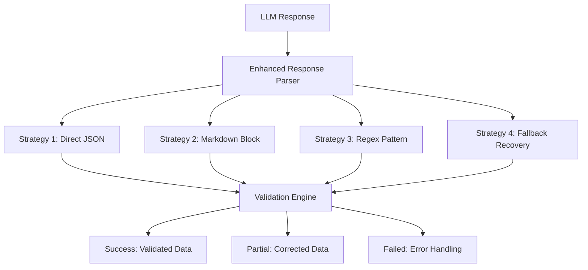
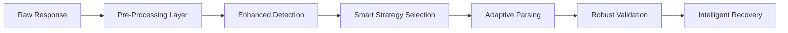
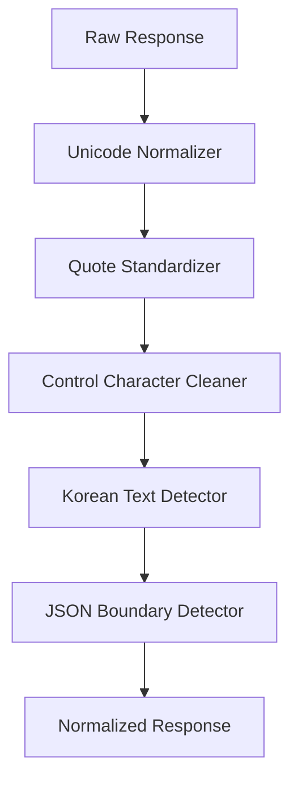
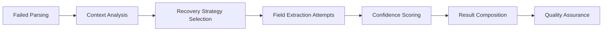
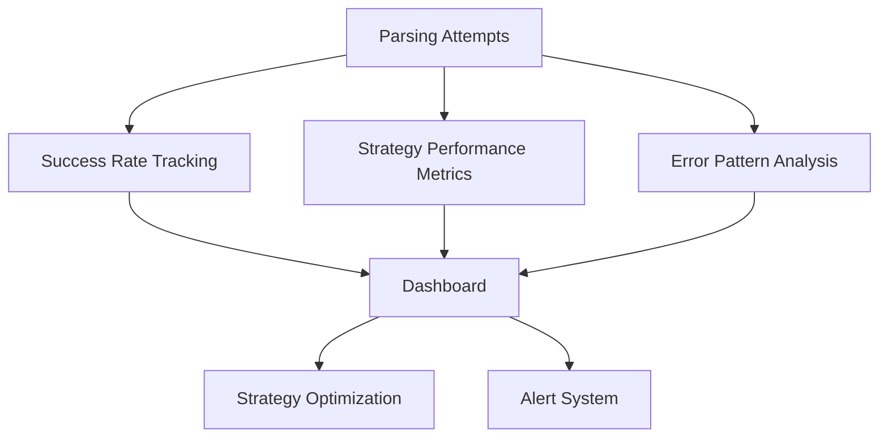

# LLM Parsing Error Fix Design Document

## Overview

This document outlines the design for fixing LLM response parsing failures in the RAG-based geography essay auto-grading platform. The system currently implements an enhanced response parser with multiple strategies but still experiences parsing failures that need to be addressed.

## Technology Stack & Dependencies

- **Backend**: Python 3.10+, LangChain, Pydantic
- **LLM Providers**: OpenAI, Google Gemini, GROQ
- **Parsing Framework**: Multi-strategy enhanced response parser
- **Validation**: Pydantic models with schema validation
- **Error Recovery**: Fallback strategies and partial content recovery

## Current Architecture Analysis

### Existing Enhanced Response Parser



### Current Parsing Strategies

| Strategy | Purpose | Success Rate | Common Issues |
|----------|---------|--------------|---------------|
| Direct JSON | Clean JSON responses | High (90%+) | Fails with malformed JSON |
| Markdown Block | Code block wrapped JSON | Medium (70%) | Missing language tags |
| Regex Pattern | Complex nested JSON | Medium (60%) | Unmatched braces |
| Fallback Recovery | Text-based recovery | Low (30%) | Limited field extraction |

## Problem Analysis

### Common Parsing Failure Patterns

1. **JSON Structure Issues**
   - Unmatched braces `{` and `}`
   - Missing commas between fields
   - Trailing commas
   - Mixed quote types (single vs double)

2. **Korean Language Issues**
   - Unicode encoding problems
   - Field name variations (한글 vs English)
   - Content with special Korean characters

3. **LLM Response Variations**
   - Extra explanatory text before/after JSON
   - Multiple JSON blocks in response
   - Incomplete responses due to token limits

4. **Schema Validation Failures**
   - Missing required fields (채점결과, 피드백)
   - Type mismatches (int vs str)
   - Nested structure variations

## Proposed Solutions Architecture

### Enhanced Error Detection System



### 1. Pre-Processing Layer Enhancement

#### Response Normalization
- Unicode normalization for Korean text
- Quote standardization (single → double)
- Whitespace cleanup and formatting
- BOM (Byte Order Mark) removal

```python
class ResponsePreProcessor:
    def normalize_response(self, response: str) -> str:
        # Unicode normalization
        response = unicodedata.normalize('NFC', response)
        
        # Quote standardization
        response = self._standardize_quotes(response)
        
        # Remove BOM and control characters
        response = self._clean_control_chars(response)
        
        return response
```

#### Content Detection Enhancement
- Korean field name detection patterns
- JSON block boundary detection
- Nested structure depth analysis
- Token truncation detection

### 2. Smart Strategy Selection

#### Context-Aware Strategy Ordering
```python
class AdaptiveStrategySelector:
    def select_strategies(self, context: ExtractionContext) -> List[Strategy]:
        strategies = []
        
        if context.has_korean_content:
            strategies.append(KoreanAwareJSONStrategy)
        
        if context.response_truncated:
            strategies.append(TruncatedResponseStrategy)
        
        if context.multiple_json_blocks:
            strategies.append(MultiBlockExtractionStrategy)
        
        return strategies + self.default_strategies
```

### 3. New Specialized Parsing Strategies

#### Korean-Aware JSON Strategy
- Enhanced Unicode handling
- Korean field name mapping
- Localized error messages

#### Truncated Response Recovery Strategy
- Partial JSON reconstruction
- Field completion from context
- Confidence scoring for incomplete data

#### Multi-Block Extraction Strategy
- Multiple JSON block detection
- Block relevance scoring
- Merged result composition

### 4. Robust Validation Engine Enhancement

#### Field Mapping Improvements
```python
class EnhancedFieldMapper:
    KOREAN_FIELD_MAPPINGS = {
        '점수': 'score',
        '총점': 'total_score',
        '세부점수': 'detailed_scores',
        '채점결과': 'grading_result',
        '피드백': 'feedback',
        '개선사항': 'improvements'
    }
    
    def map_korean_fields(self, data: dict) -> dict:
        mapped = {}
        for key, value in data.items():
            mapped_key = self.KOREAN_FIELD_MAPPINGS.get(key, key)
            mapped[mapped_key] = value
        return mapped
```

#### Type Coercion Enhancement
- Intelligent type inference
- Safe conversion with validation
- Fallback value generation

### 5. Intelligent Recovery System

#### Confidence-Based Recovery
```python
class IntelligentRecovery:
    def recover_with_confidence(self, 
                              failed_data: dict, 
                              original_response: str) -> RecoveryResult:
        
        recovery_strategies = [
            self._regex_field_extraction,
            self._template_matching,
            self._ml_based_extraction,
            self._context_inference
        ]
        
        best_result = None
        highest_confidence = 0.0
        
        for strategy in recovery_strategies:
            result = strategy(failed_data, original_response)
            if result.confidence > highest_confidence:
                best_result = result
                highest_confidence = result.confidence
        
        return best_result
```

## Component Architecture

### 1. Enhanced Pre-Processor Component


### 2. Strategy Factory Enhancement
- Dynamic strategy registration
- Context-based strategy weighting
- Performance-based strategy optimization

### 3. Validation Engine Improvements
- Schema flexibility configuration
- Progressive validation levels
- Custom validation rules for Korean content

### 4. Recovery Engine Architecture


## Error Handling Strategy

### Graceful Degradation Levels

1. **Level 1: Full Success**
   - Complete JSON parsing
   - All fields validated
   - High confidence score (>0.9)

2. **Level 2: Partial Success**
   - Core fields extracted (채점결과, 피드백)
   - Some validation warnings
   - Medium confidence score (0.5-0.9)

3. **Level 3: Minimal Recovery**
   - Basic score extraction
   - Text-based feedback
   - Low confidence score (0.1-0.5)

4. **Level 4: Fallback Mode**
   - Template-based response
   - Manual review flag
   - Error logging for analysis

### Error Logging Enhancement
```python
class ParsingErrorLogger:
    def log_parsing_failure(self, 
                          response: str, 
                          attempts: List[ParsingAttempt],
                          final_result: ParsingResult):
        
        error_context = {
            'response_length': len(response),
            'detected_language': self._detect_language(response),
            'has_korean': self._has_korean_content(response),
            'json_structure_issues': self._analyze_json_issues(response),
            'attempted_strategies': [a.strategy.value for a in attempts],
            'failure_reasons': [a.error_message for a in attempts if not a.success]
        }
        
        logger.error("Parsing failure analysis", extra=error_context)
```

## Testing Strategy

### 1. Unit Testing Enhancement
- Korean text parsing tests
- Unicode edge case testing
- Truncated response handling
- Multi-JSON block scenarios

### 2. Integration Testing
- End-to-end parsing pipeline tests
- LLM provider response variations
- Performance benchmarking
- Error recovery validation

### 3. Regression Testing
```python
class RegressionTestSuite:
    def test_known_failure_patterns(self):
        """Test against previously failed parsing cases"""
        failure_cases = self.load_historical_failures()
        
        for case in failure_cases:
            result = self.enhanced_parser.parse_response(
                case.response, 
                case.parser
            )
            assert result.success_level != SuccessLevel.FAILED
```

## Performance Optimization

### Caching Strategy
- Response pattern caching
- Strategy success rate tracking
- Dynamic timeout adjustment
- Memory-efficient partial result storage

### Monitoring & Analytics


## Implementation Roadmap

### Phase 1: Core Infrastructure (Week 1-2)
- Enhanced pre-processing layer
- Korean-aware field mapping
- Improved error logging

### Phase 2: Strategy Enhancement (Week 3-4)
- New specialized strategies
- Smart strategy selection
- Confidence-based recovery

### Phase 3: Validation & Recovery (Week 5-6)
- Robust validation engine
- Multi-level recovery system
- Comprehensive testing

### Phase 4: Optimization & Monitoring (Week 7-8)
- Performance optimization
- Monitoring dashboard
- Production deployment

## Configuration Management

### Parsing Configuration Enhancement
```python
@dataclass
class EnhancedParsingConfig:
    # Existing configurations
    max_attempts: int = 5
    timeout_seconds: float = 30.0
    enable_fallback_recovery: bool = True
    
    # New configurations
    korean_aware_parsing: bool = True
    unicode_normalization: bool = True
    multi_json_handling: bool = True
    confidence_threshold: float = 0.3
    max_recovery_attempts: int = 3
    
    # Strategy weights
    strategy_weights: Dict[str, float] = field(default_factory=lambda: {
        'direct_json': 1.0,
        'korean_aware': 1.2,
        'markdown_block': 0.8,
        'regex_pattern': 0.6,
        'fallback_recovery': 0.4
    })
```

## Success Metrics

### Key Performance Indicators
- **Parsing Success Rate**: Target >95% (currently ~85%)
- **Recovery Success Rate**: Target >80% (currently ~60%)
- **Processing Time**: Target <500ms (currently ~300ms)
- **Korean Content Accuracy**: Target >90%

### Quality Metrics
- Field extraction accuracy
- Schema validation pass rate
- Error recovery confidence scores
- User satisfaction with auto-grading results

## Risk Mitigation

### Identified Risks
1. **Performance Impact**: Enhanced processing may slow down grading
2. **Compatibility**: Changes may break existing integrations
3. **Korean Language Edge Cases**: Complex linguistic patterns
4. **LLM Provider Variations**: Different response formats

### Mitigation Strategies
- Progressive rollout with feature flags
- Comprehensive backward compatibility testing
- Korean language expert consultation
- Provider-specific adaptation layers